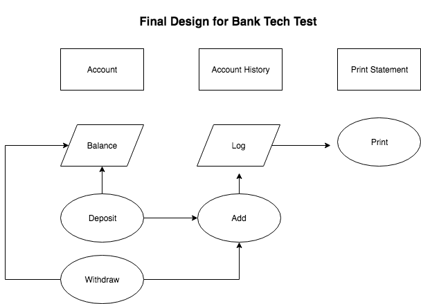

# Bank Tech Test

This Project was set by Makers Academy as a practise tech test.

### User Stories
```
As a User
So I keep track of my money
I would like to have a bank account balance

As a User
So I can save money
I would like to deposit into my bank account

As a User
So I do not go overdrawn
I will receive a error if trying to withdraw money i do not have

As a User
So I can spend my money
I would like to withdraw from my bank account

As a User
So i can see previous transactions
I would like to be able to print my statement
```

### Planning

Preliminary Design


Final Design



### Installation

1. Fork and clone the repository
2. Open ``app.html`` in the browser and open the developer tools to use the app

### How To Use

1. To make deposits enter the amount and the date of the deposit.
```
account.deposit(amount, DD-MM-YYYY);
```

2. To make withdrawals enter the amount and the date of the withdrawals.
```
account.withdraw(amount, DD-MM-YYYY);
```


### Testing

The project was tested via Jasmine

To run the tests open ``SpecRunner.html`` in the browser.
